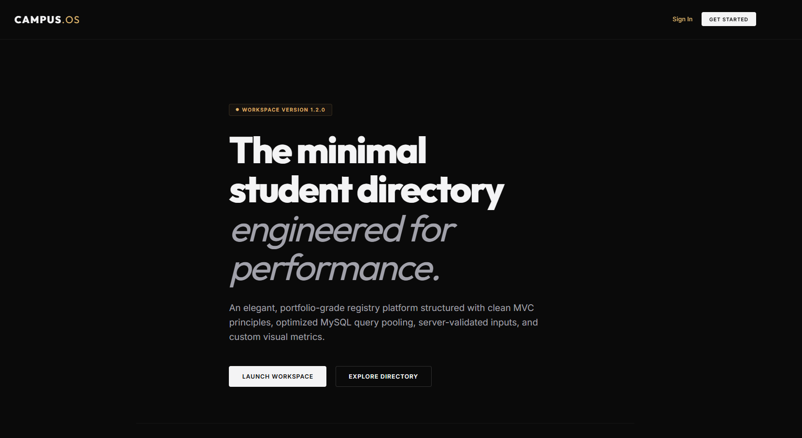

# CampusOS - Premium Student Directory

CampusOS is a sleek, modern, and portfolio-grade Student Directory and registry application built using Node.js, Express, and MySQL. It features an interactive dashboard, clean analytics, and responsive student profiling. 

Designed with an editorial, minimalist aesthetic inspired by modern design agencies, CampusOS aims to present academic administration tools with maximum craftsmanship.



## Features

* **Complete Authentication System**: Secure user onboarding, authentication, and session handling:
  * **Administrative Registry**: Self-sign registers and credential checks.
  * **Email Verification**: Automatic onboarding verification mailer. Blocks student registry operations until verified.
  * **Password Recoveries**: Recover password triggers sending single-hour expiration reset tokens.
  * **Remember Me & Session States**: Long-term login caching using secure JWT storage.
  * **Protected Routes**: Frontend hash redirects and backend authentication middlewares block unauthenticated accesses.
* **Interactive Dashboard**: A modular grid featuring enrollment growth trends (Line Chart) and department distributions (Doughnut Chart) that automatically adjust theme styling based on system preferences.
* **Student Catalog**: An elegant catalog showing student profile cards with outlined department and year tags.
* **Notion-Style Drawer**: Clicking a student's card slides out a clean, product-spec-inspired profile detail panel.
* **Full CRUD Operations**:
  * **Register**: Create new student profiles with robust client-side and server-side validation.
  * **Modify**: Update student details inline.
  * **Dismiss**: Safely delete student records after confirming with a modal check.
* **Security & Performance**: Uses parameter-bound MySQL prepared statements to secure inputs against SQL injection and utilizes connection pooling for optimal database lifecycles.
* **Resilient Fallbacks**: The system remains functional even if external resources (like Chart.js) fail to load, showing helpful placeholder messages rather than throwing runtime errors.

## Tech Stack

* **Frontend**: HTML5, Vanilla CSS3 (Custom transitions, prefers-color-scheme responsive dark/light styling, flexbox/grid layout), JavaScript (Modern ES6 SPA Hash Router)
* **Backend**: Node.js & Express.js (utilizing `bcrypt` for password hashing, `jsonwebtoken` for secure session signing, and `nodemailer` for email deliveries)
* **Database**: MySQL (using `mysql2` connection pool)
* **Visualizations**: Chart.js (CDN-delivered with local runtime fallback checks)

---

## Getting Started

### Prerequisites
* [Node.js](https://nodejs.org/) installed
* [MySQL Server](https://www.mysql.com/) running locally

### 1. Clone & Install
```bash
git clone https://github.com/harshithcheripally16-ui/student-management-system-nodejs-mysql.git
cd student-management-system-nodejs-mysql
npm install
```

### 2. Configure Environment variables
Create a `.env` file in the root directory (using `.env.example` as a template) and add your database and authentication configuration:
```env
PORT=3000
NODE_ENV=development

# MySQL Database Configuration
DB_HOST=127.0.0.1
DB_PORT=3306
DB_USER=your_mysql_username
DB_PASSWORD=your_mysql_password
DB_NAME=student_db
DB_CONNECTION_LIMIT=10

# JWT Security
JWT_SECRET=your_jwt_signing_secret_here

# SMTP Configuration (Optional for development)
# If left empty, mail verification and reset links will log directly to the terminal stdout.
SMTP_HOST=smtp.mailtrap.io
SMTP_PORT=2525
SMTP_USER=your_smtp_username
SMTP_PASS=your_smtp_password
SMTP_SECURE=false
SMTP_FROM=CampusOS <noreply@campusos.edu>
```

### 3. Initialize & Start
Run the start command. The server will automatically connect to MySQL, verify the connection pool, create the `student_db` database if it doesn't exist, and create the required table structures:
```bash
npm start
```

Once running, visit `http://localhost:3000` in your web browser.

---

## API Endpoints

* `GET /students` - Retrieves all student records.
* `GET /students/:id` - Retrieves details of a specific student.
* `POST /students` - Creates a new student profile (validated).
* `PUT /students/:id` - Updates an existing student profile.
* `DELETE /students/:id` - Removes a student record by ID.

## Author

**Harshith Cheripally**
* GitHub: [@harshithcheripally16-ui](https://github.com/harshithcheripally16-ui)
