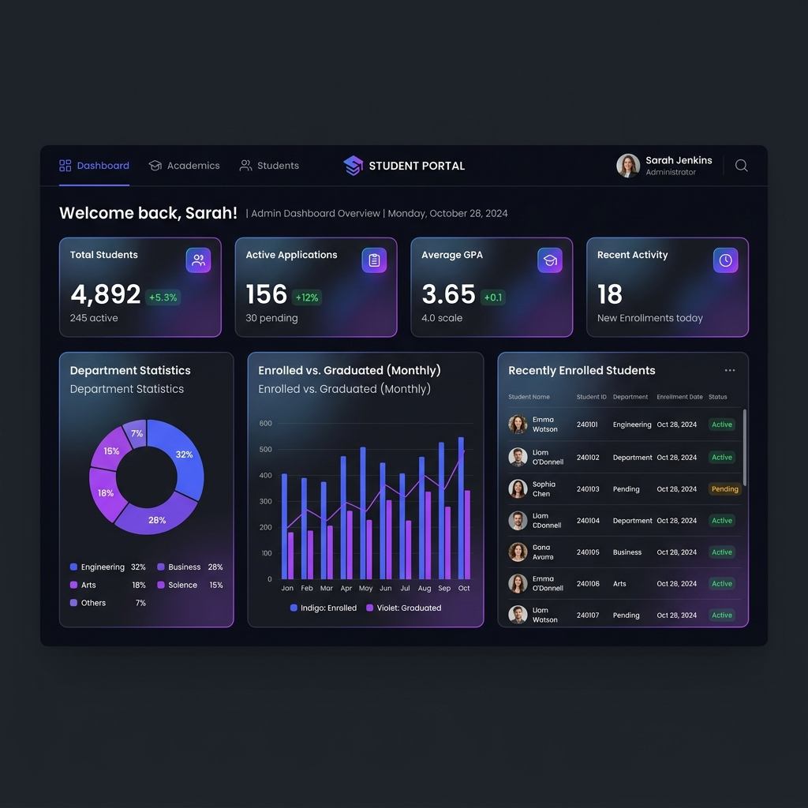

# Student Management System

A simple and responsive web application designed to manage student records. It features an interactive dashboard, visual statistics, and student profiling, allowing users to add, view, update, search, and delete student records.

## Features

* **Add Students**: Register new students with their name, email, department, and academic year.
* **View Students**: Displays student records in a clean profile card layout with quick action buttons.
* **Update Student Information**: Easily edit and update existing student profiles.
* **Delete Students**: Permanently remove student records from the database.
* **Search Students**: Instant search to filter students by name, email, or department.
* **Responsive Dashboard**: Beautiful charts showing enrollment trends and department distribution.
* **MySQL Database Integration**: Safe data persistence using connection pooling and parameterized queries.

## Technologies Used

* **Node.js** & **Express.js** (Backend)
* **MySQL** (Database)
* **HTML5**, **CSS3**, & **JavaScript** (Frontend SPA)
* **Chart.js** (Analytics Visualizations)
* **GSAP** (Smooth UI Animations)
* **Git** (Version Control)

## Screenshots

### Interactive Dashboard Layout
The clean, dark-themed responsive dashboard displaying student distribution analytics, quick KPI cards, search controls, and the list of student records.



## Installation

Follow these steps to set up and run the project locally:

### 1. Clone the repository
```bash
git clone https://github.com/harshithcheripally16-ui/student-management-system-nodejs-mysql.git
cd student-management-system-nodejs-mysql
```

### 2. Install dependencies
```bash
npm install
```

### 3. Configure the environment variables
Create a `.env` file in the root directory (you can copy `.env.example` as a template) and update your MySQL connection details:
```env
PORT=3000
DB_HOST=127.0.0.1
DB_USER=root
DB_PASSWORD=your_mysql_password
DB_NAME=student_db
```

### 4. Start the server
```bash
npm start
```
*(The server will automatically connect to MySQL, create the `student_db` database, and initialize the required table structures).*

Open your browser and visit `http://localhost:3000` to view the application.

## API Endpoints

* **GET /students** - Fetch all student records.
* **GET /students/:id** - Get details for a specific student.
* **POST /students** - Create a new student record.
* **PUT /students/:id** - Update an existing student record.
* **DELETE /students/:id** - Delete a student record by ID.

## Author

**Harshith Cheripally**

* GitHub: [harshithcheripally16-ui](https://github.com/harshithcheripally16-ui)
